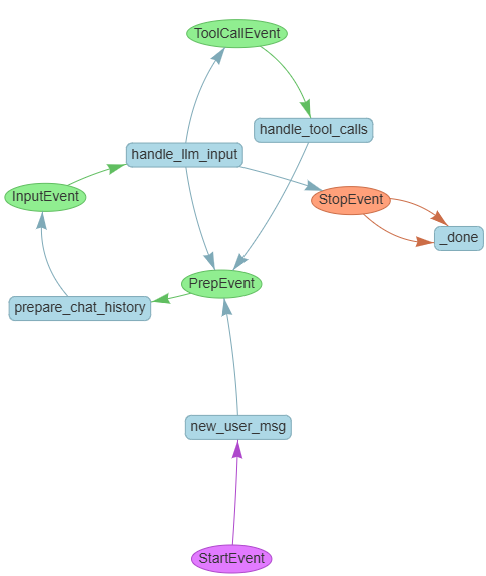

# Wiki Search ReAct Agent

This project implements a ReAct-based agent wrapped inside a WebSocket server. The agent interacts with Wikipedia using two tools: one for finding similar articles and another for retrieving specific article content. The backend service is connected to Phoenix, a traceability platform that provides observability for each query processed by the ReAct agent. The agent utilizes OpenAI's GPT-4o model for reasoning and generating responses.

The agent is designed to answer three types of wikipedia-based queries:

1. **Question Answering**: Answering questions that are answerable by a wikipedia query (eg: "Who scored the most goals in the European Champion's League in 2020?").
2. **Similar Articles**: Finding similar articles based on a given article (eg: "articles similar to the article on 'Philosophy'?")
3. **Exploring a topic**: Providing information on a general topic (eg: "css flex")

## Dependencies

1. Docker installed and running on the host machine.
2. Access to pull images from Docker Hub.
3. An OpenAI API key for accessing GPT-4o. Add this key to the .env file as follows:

```bash
OPENAI_API_KEY=<your_openai_api_key>
```

## Project Structure

```bash
/wiki_search/
│
├── backend/              # Backend service
│   ├── src/              # Source code for the backend
│   │   ├── __init__.py
│   │   ├── main.py       # Web socket server
│   │   ├── agents.py     # Agent and workflow classes
│   │   ├── tools.py      # Tools and function definitions
│   │   ├── events.py     # Custom event classes
│   │   └── utils.py      # Utility functions
│   ├── Dockerfile        # Docker configuration for backend
│   ├── requirements.txt  # Dependencies for backend
│
├── tests/                # Unit and integration tests
│   └── test_main.py      # Example test cases
│
├── images/               # Images for the README
│   └── workflow_diagram.png  # Workflow diagram
│
├── data/                 # Data for the ReAct agent
│   ├── eval_queries/     # Queries used for evaluation
│   └── eval_results/     # Results from evaluation
|
├── client.py             # CLI for interacting with the ReAct agent (web socket client)
├── eval.py               # RAGAS-based evaluation script for the ReAct agent (web socket client)
├── docker-compose.yaml   # Docker Compose file for the entire project
├── README.md             # Project description
└── .env                  # Environment variables (add OpenAI API key)
```

## Application Overview

The application consists of two primary services:

1. **Phoenix (Traceability Service)**:
   - Phoenix is responsible for providing traceability and observability for each ReAct query processed by the backend.
   - It runs in a Docker container and listens for OpenTelemetry traces sent by the ReAct agent.
   - Phoenix helps monitor the flow of data across different stages of the ReAct workflow.

2. **ReAct Agent Backend**:
   - The ReAct agent backend runs in a separate Docker container, providing a WebSocket-based interface for receiving queries and sending responses.
   - This backend is powered by a ReAct-based agent that interacts with two Wikipedia tools:
     1. **BM25-based full-text search for similar articles**.
     2. **Full article retrieval**.
   - The agent is wrapped in a workflow that handles the sequence of events involved in processing a query. It uses GPT-4o from OpenAI for reasoning and response generation.

## Installation and Running the Application

### Prerequisites

1. **Docker**: Ensure that Docker is installed and running on your host machine.
2. **Docker Hub Access**: Ensure you have access to pull images from Docker Hub.
3. **OpenAI API Key**: You need an OpenAI API key to interact with GPT-4o.

### Steps to Run the Application

1. **Clone the Repository**:
   Clone this repository to your local machine:
   
   ```bash
   git clone https://github.com/your-repo/wiki_search.git
   cd wiki_search
   ```

2. **Configure .env File: Create an .env file in the root directory with your OpenAI API key:**:
   ```bash
   OPENAI_API_KEY=<your_openai_api_key>
   ```

3. **Build and Run the Application**:
   Use Docker Compose to build and run the application:
   ```bash
   docker-compose up --build
   ```
   This will start two containers:

   - Phoenix: A traceability server for ReAct queries.
   - Backend: The ReAct agent wrapped in a WebSocket service.

4. **Online Monitoring: Access Phoenix**:
   - Open your browser and navigate to `http://localhost:6006/projects/` to monitor the traces from the ReAct agent.

5. **Run the CLI Interface**:
   Once the Docker services are running (and give it a minute or two for them both to fully load), you can interact with the agent via a CLI. Simply run the following command in a new terminal session:
   ```bash
   python client.py
   ```
    You will be prompted to enter your queries, and the agent will respond using Wikipedia-based tools, with each query traceable through Phoenix. The agent will process your query, possibly calling Wikipedia tools to retrieve content or related articles, and return an answer.

## ReAct Agent Architecture
    The ReAct agent processes queries in a loop using several key events and actions to process user queries. Below is a description of the event-based architecture:

    - **Events**: These events trigger specific actions within the ReAct agent's workflow.

        1. **StartEvent**: The starting event that initializes the user session.
        2. **PrepEvent**: Prepares the agent to handle a new query.
        3. **InputEvent**: Represents the user's input to be processed by the agent.
        4. **ToolCallEvent**: Represents a call to one of the available tools (e.g., Wikipedia article retrieval).
        5. **StopEvent**: Marks the end of a session or query.

    - **Actions**: These actions are performed at different stages of the workflow.

        1. **new_user_msg**: Handles a new message from the user and updates the conversation history.
        2. **prepare_chat_history**: Prepares the chat history and formats it for the next step.
        3. **handle_llm_input**: Processes the input using the LLM and decides whether to respond directly or call a tool.
        4. **handle_tool_calls**: Executes the required tool call and returns the output to the conversation.

### Workflow Diagram

The following diagram illustrates the ReAct agent workflow:



    - **Loops and Tools**: When the agent reaches the handle_llm_input action, it can either decide that it has enough information to answer the query directly or call one of the tools (Wikipedia search or content retrieval). After a tool is called, the loop continues, with the tool output being added to the chat history, and the LLM is called again if needed.


## Future Work

- Find a workaround for the PageErrors returned by Wikipedia's search (recently edited pages not yet fully indexed in API) -- results in poor performance on current events. 
- Use RAGAS' synethetic data generation to create more out-of-distribution test data
- Current evaluations are end-to-end response evaluations. Build in more component-specific evaluation to the CoT process.
- Integrate RAGAS evaluations into the Phoenix dashboard.
- Leverage Phoenix traceability to create feedback loop: new training and evaluation datasets based off of interesting traces from Phoenix UI.
- Late chunking and semantic search of Wikipedia content to reduce token usage and costs.
- Guardrails on inputs and outputs.
- Explore OpenAI's o1 performance and methods of adapting inference based CoT prompting when using these models.
- Streaming responses from the agent at all intermediate steps.
- More robust unit and integration testing.